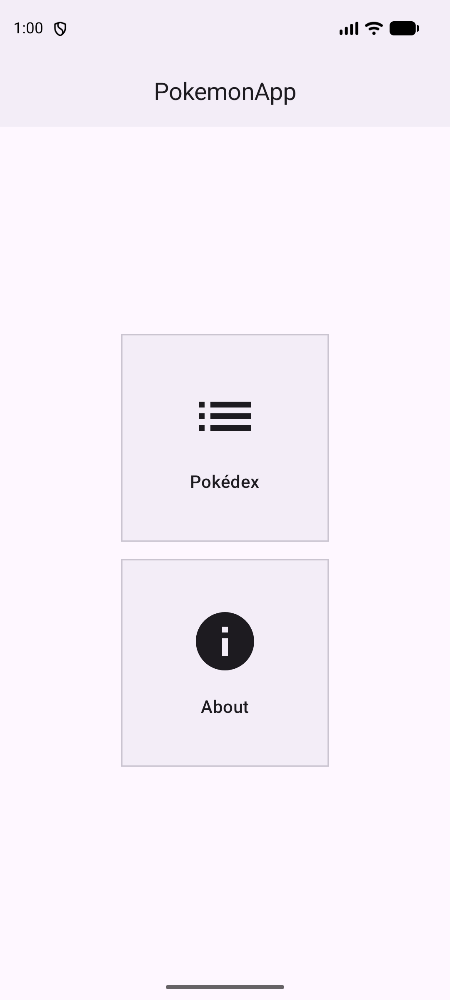
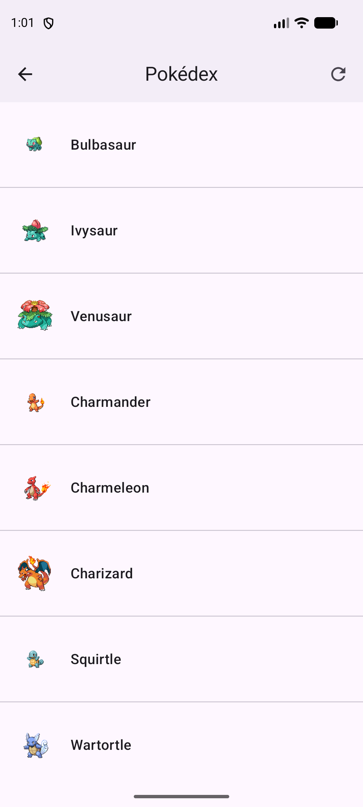
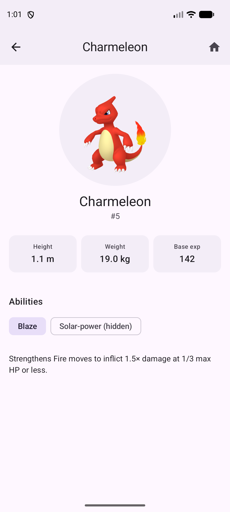

# PokemonApp

A native Android Pokédex built with Jetpack Compose, backed by the
[PokéAPI](https://pokeapi.co/). Browse Pokémon, page through the full
national dex, and open any entry to see its stats, abilities, and ability
descriptions — with an offline-first cache so the list keeps working without
a network connection.

<p align="center">
  
  
  
</p>

## Features

- **Pokédex list** — infinite-scroll paging through the full PokéAPI Pokémon
  list, with offline caching (the list keeps showing cached data with no
  network, and syncs again once it's back). Two ways to refresh: pull down
  from the top, or tap the toolbar refresh icon — the latter works from
  anywhere in the list without scrolling back up first.
- **Pokémon detail** — sprite, height/weight/base experience stat cards, and
  every ability as a selectable chip.
- **Ability descriptions** — tap an ability chip to fetch and cache its
  in-game effect text; already-seen descriptions are read from a local cache
  instead of hitting the network again.
- **Navigation** — a Home hub with shortcuts to the Pokédex and an About
  screen, using type-safe Jetpack Navigation routes.
- **Adaptive app icon and splash screen**, dark status-bar icons tuned for
  the app's light surfaces.

## Architecture

The app follows a standard MVVM structure with a repository as the single
source of truth for data:

```
UI (Compose)  →  ViewModel  →  Repository  →  Room (cache) / Retrofit (network)
```

- **UI**: Jetpack Compose end to end. Every screen is split into a
  *stateful* entry point (binds the ViewModel) and a *stateless* body (takes
  plain state + callbacks), so the stateless half renders in
  `@Preview` without a ViewModel, Hilt, or a network call.
- **Navigation**: [Navigation Compose](https://developer.android.com/guide/navigation/design/type-safety)
  with `@Serializable` routes instead of string paths.
- **State**: each screen exposes a sealed `UiState` (`Loading` /
  `Success` / `Error`) as a `StateFlow`, collected with
  `collectAsStateWithLifecycle()`.
- **Pagination**: [Paging 3](https://developer.android.com/topic/libraries/architecture/paging/v3-overview)
  with a `RemoteMediator` that syncs a Room table from the network —
  Room is the source of truth the UI reads, so the list survives process
  death and shows cached pages offline. A TTL skips the network refresh
  entirely when the cache is still fresh, so a normal app relaunch doesn't
  re-fetch (or discard) data the user already scrolled through.
- **Dependency injection**: [Hilt](https://developer.android.com/training/dependency-injection/hilt-android).
  ViewModels take their dependencies through the constructor, which also
  makes them straightforward to unit test with fakes.
- **Networking**: Retrofit + OkHttp, with `kotlinx.serialization` for JSON
  (no reflection-based parsing).
- **Images**: [Coil 3](https://coil-kt.github.io/coil/), sharing the same
  OkHttp client as Retrofit.

### Project structure

```
data/            Repository, RemoteMediator, Room entities/DAOs, DI modules
model/           API response models (kotlinx.serialization)
retrofit/        API interface
ui/              Compose screens and shared components
ui/navigation/   Type-safe navigation routes
viewmodel/       ViewModels and their UiState definitions
```

## Tech stack

| | |
|---|---|
| Language | Kotlin |
| UI | Jetpack Compose, Material 3 |
| Navigation | Navigation Compose (type-safe routes) |
| DI | Hilt |
| Networking | Retrofit, OkHttp, kotlinx.serialization |
| Local storage | Room (+ Paging 3 `RemoteMediator`) |
| Images | Coil 3 |
| Async | Kotlin Coroutines & Flow |
| Testing | JUnit, kotlinx-coroutines-test |
| Build | Gradle Kotlin DSL, version catalogs, KSP |

## Requirements

- Android Studio (a recent stable release)
- JDK 17
- Android SDK with `compileSdk`/`targetSdk` 36 installed
- minSdk 28 (Android 9.0+)

## Building

```bash
git clone https://github.com/davidbrazuna/pokemonapp.git
cd pokemonapp
./gradlew assembleDebug
```

Or open the project in Android Studio and run the `app` configuration.

A signed release build additionally needs a `keystore.properties` file
(copy `keystore.properties.example`, fill in your own values — it's
gitignored and never committed). Debug builds don't need it.

### Tests

```bash
./gradlew testDebugUnitTest
```

## API

All Pokémon data comes from the public [PokéAPI](https://pokeapi.co/) — no
API key required.

## License

This is a personal portfolio project. Pokémon and Pokémon character names
are trademarks of Nintendo/Creatures Inc./GAME FREAK inc.
